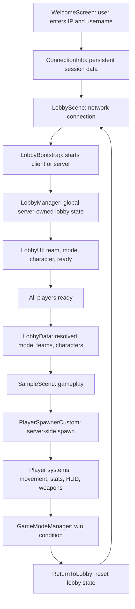

# Dissertation Draft - Rebel Campus

> Review draft for the dissertation. This file is intentionally written in Markdown so it can be reviewed and corrected before the final content is moved into `Template AC EN.docx`.
>
> Important: sections marked `AUTHOR CONTEXT NEEDED` require your confirmation. They are not filled with invented personal motivation, testing results, team ownership, or deployment history.

## Front Matter

### Thesis Title

`AUTHOR CONTEXT NEEDED`: Confirm final thesis title.

Working title: **Design and Implementation of a Server-Authoritative Multiplayer Shooter in Unity and FishNet**

### Candidate

`AUTHOR CONTEXT NEEDED`: Candidate full name.

### Scientific Coordinator

`AUTHOR CONTEXT NEEDED`: Coordinator academic title and full name.

### Session

`AUTHOR CONTEXT NEEDED`: Defense session.

### Abstract in Romanian

`AUTHOR CONTEXT NEEDED`: The template states that a Romanian abstract is mandatory when the dissertation is written in a language other than Romanian. This section should be translated after the English abstract is approved.

### Abstract

This dissertation presents the design and implementation of **Rebel Campus**, a multiplayer third-person shooter developed in Unity 6 using FishNet as the networking framework. The project focuses on a server-authoritative multiplayer architecture that supports direct IP connection, a networked lobby, character selection, team assignment, match start synchronization, late joining, server-side player spawning, deathmatch game logic, AI-controlled turrets, client input handling, HUD elements, and cross-platform controls. The implementation combines Unity technologies such as URP, the Input System, Cinemachine, Animation Rigging, and AI Navigation with FishNet networking primitives such as `NetworkBehaviour`, `SyncVar`, `SyncList`, `ServerRpc`, `ObserversRpc`, `TargetRpc`, and server-side object spawning.

The dissertation describes the complete game system while emphasizing the author's contributions in depth. These contributions include game direction and design coordination, client camera behavior, client smoothness improvements, input and joystick support, menu and IP connection flow, server setup, player spawning, player name display and sanitization, scoreboard and player HUD, deathmatch game mode, turret behavior, lobby logic, matchmaking-style lobby flow, late join handling, character selection, server lifecycle handling, Android support, and project management activities. The resulting project demonstrates the practical challenges of building a multiplayer game prototype that must coordinate network state, user interface, gameplay authority, and deployment constraints across several client and server environments.

`AUTHOR CONTEXT NEEDED`: Add concrete test results, deployment metrics, or user feedback if available.

### Table of Contents

`TO BE GENERATED IN WORD`: The final table of contents should be generated in Microsoft Word after the Markdown draft is transferred to the `.docx` template.

## 1. Introduction

### 1.1 Context

Multiplayer games combine gameplay design, real-time networking, user interface design, content production, and deployment engineering. Unlike single-player games, a multiplayer project must solve not only the local simulation of player input and feedback, but also the synchronization of multiple clients connected to the same match. The project presented in this dissertation, **Rebel Campus**, was developed as a dissertation game project by a team of four developers. The codebase is implemented in Unity and uses FishNet as the multiplayer networking layer.

The current project is built with Unity `6000.3.6f1` and uses the Universal Render Pipeline, the Unity Input System, Cinemachine, Animation Rigging, AI Navigation, TextMeshPro, and FishNet. Its scene flow contains three main scenes: `WelcomeScreen`, `LobbyScene`, and `SampleScene`. The player first enters a username and server address, then joins a networked lobby, selects game preferences and character options, and finally transitions into the gameplay map once the match starts.

The repository name, `MultiplayerAuth`, suggests an authentication-oriented multiplayer template. In the current implementation, however, the project does not contain a full account authentication system, password exchange, token validation, or a configured FishNet `Authenticator`. Instead, the connection flow uses a sanitized username and a server IP address. This limitation is important for the dissertation because it separates identity presentation from real authentication.

### 1.2 General Information About the Proposed Game

`AUTHOR CONTEXT NEEDED`: Confirm the final game name. This draft uses **Rebel Campus**, based on the product name found in the Unity project settings and the project context discovered in the codebase.

Rebel Campus is a multiplayer shooter prototype in which players connect to a server, enter a lobby, choose a team, vote for a game mode, select a playable character, and fight in a match. The game supports Free For All and Team Deathmatch logic, server-spawned player characters, networked health and kill/death statistics, player respawning, HUD feedback, scoreboard display, AI turret behavior, mobile/twin-stick controls, and late joining into an active game.

### 1.3 Game Type

The game is best described as a **networked third-person shooter with team-based and free-for-all deathmatch modes**. It uses real-time character control, weapon-based combat, synchronized player state, networked game rules, and multiplayer lobby flow. Some code and prior documentation call the project a first-person or third-person shooter; the current implementation should be described according to the camera and gameplay mode actually used in the final build.

`AUTHOR CONTEXT NEEDED`: Confirm whether the final written description should say third-person shooter, top-down shooter, or another term based on the final camera.

### 1.4 Target Audience

`AUTHOR CONTEXT NEEDED`: Define the intended target audience.

Draft placeholder: The target audience consists of players interested in short, competitive multiplayer matches with accessible controls, fast respawning, and clear team objectives. The project also targets academic evaluation, demonstrating the technical implementation of a networked Unity game rather than only a finished commercial game.

### 1.5 Motivation and Objectives

`AUTHOR CONTEXT NEEDED`: Provide your personal motivation and project objectives. The following is a technical draft that should be adapted to your real motivation.

The main motivation behind the project was to build a complete multiplayer game prototype that demonstrates core problems encountered in real-time game development: network connection setup, server-authoritative gameplay, lobby synchronization, player spawning, camera control, input handling, mobile controls, user interface feedback, and match lifecycle management. The project was also intended to show how a small development team can integrate gameplay systems and networking decisions into a playable experience.

The main objectives were:

- To implement a playable multiplayer shooter in Unity.
- To use FishNet for client-server networking and synchronized state.
- To implement a direct connection flow using a user-provided IP address and sanitized username.
- To build a lobby that lets players view each other, choose teams, vote for a game mode, select characters, and ready up.
- To transition all players from the lobby scene into the gameplay scene using FishNet scene loading.
- To spawn players server-side according to selected teams and characters.
- To implement match rules for Free For All and Team Deathmatch.
- To provide UI systems such as player HUD, scoreboard, kill feed, loading feedback, lobby feedback, and late join interface.
- To support desktop and Android input patterns.
- To deploy or test the server in multiple hosting configurations.

### 1.6 Player Objectives

In a match, the player objective is to defeat other players while avoiding death. In Free For All mode, each player competes individually, and the winner is the first player to reach the configured kill limit. In Team Deathmatch mode, players are assigned to the Rebels or AI team, and the team kill total determines the winner. The player also interacts with the lobby before gameplay by selecting a team, preferred game mode, and playable character.

### 1.7 Short Description of the Game

Rebel Campus is a multiplayer shooter prototype developed in Unity with FishNet networking. Players connect to a server using a username and IP address, coordinate in a networked lobby, and enter a match once everyone is ready. During gameplay, the server manages player spawning, health, kills, deaths, respawning, match results, and return-to-lobby flow. The game includes character selection, team assignment, score tracking, player HUD, mobile controls, late join handling, and AI turret behavior.

### 1.8 Dissertation Structure

Chapter 1 introduces the project, motivation, and objectives. Chapter 2 studies similar multiplayer shooter games and compares their mechanics with Rebel Campus. Chapter 3 presents the technologies and theoretical foundations used in the project. Chapter 4 describes the proposed solution and system design without focusing on code details. Chapter 5 explains the implementation, with personal contributions highlighted. Chapter 6 presents testing and experimental results. Chapter 7 discusses conclusions, limitations, and future work.

## 2. Domain Study

### 2.1 Purpose of the Domain Study

The domain study places Rebel Campus in the context of multiplayer shooter games and real-time networked gameplay. Because the project combines lobby flow, team selection, character choice, server-side spawning, deathmatch rules, and mobile input support, the comparison should include games that demonstrate similar features or design goals.

`AUTHOR CONTEXT NEEDED`: Confirm the 3-4 games to analyze. The following are candidate examples, not final choices:

- Team Fortress 2 - class-based multiplayer shooter with team objectives.
- Valorant - tactical team shooter with character abilities and round-based flow.
- Fortnite - stylized multiplayer action game with strong lobby/visual identity and cross-platform accessibility.
- Overwatch 2 - hero-based team shooter with character selection and team roles.

### 2.2 Candidate Game 1 - Team Fortress 2

`AUTHOR CONTEXT NEEDED`: Confirm whether to use this game.

Team Fortress 2 is relevant because it presents team-based shooter gameplay, strong visual identity, class selection, and readable multiplayer feedback. Its core design separates teams clearly and gives each player a visible role. Rebel Campus does not implement class-specific gameplay at the same scale, but it shares the need to communicate team membership, player identity, and combat feedback to all players.

### 2.3 Candidate Game 2 - Valorant

`AUTHOR CONTEXT NEEDED`: Confirm whether to use this game.

Valorant is relevant as an example of a modern server-authoritative tactical shooter. Its design highlights the importance of precise networking, player identity, match lifecycle, team coordination, and anti-cheat considerations. Rebel Campus is much smaller in scope, but the comparison is useful when discussing why authoritative server logic is important for damage, scoring, and match state.

### 2.4 Candidate Game 3 - Fortnite

`AUTHOR CONTEXT NEEDED`: Confirm whether to use this game.

Fortnite is relevant for its stylized interface, lobby presentation, cross-platform accessibility, and strong visual language. The procedural lobby layout in Rebel Campus is explicitly described in the code comments as using a saturated, game-like, high-contrast visual direction inspired by this type of presentation. The comparison should focus on user interface clarity and player readiness flow rather than on battle royale mechanics.

### 2.5 Candidate Game 4 - Overwatch 2

`AUTHOR CONTEXT NEEDED`: Confirm whether to use this game.

Overwatch 2 is relevant because it combines hero selection, team identity, multiplayer combat, and clear UI feedback. Rebel Campus includes a smaller character selection system based on `CharacterDefinition` assets and a lobby preview, but it does not implement complex hero abilities. The comparison can emphasize character presentation and team composition.

### 2.6 Feature Comparison Table

`AUTHOR CONTEXT NEEDED`: Confirm games and mechanics before finalizing.

| Game | Team play | Character selection | Lobby/readiness | Server-authoritative combat | Cross-platform input | Match return flow |
| --- | --- | --- | --- | --- | --- | --- |
| Team Fortress 2 | Yes | Class selection | Server/browser flow | Yes | Desktop-focused | Server map/match cycle |
| Valorant | Yes | Agent selection | Party/matchmaking flow | Yes | Desktop-focused | Round/match cycle |
| Fortnite | Yes, depending on mode | Cosmetic/skin selection | Strong lobby flow | Yes | Strong cross-platform support | Match return to lobby |
| Overwatch 2 | Yes | Hero selection | Matchmaking/hero select | Yes | Multi-platform | Match cycle |
| Rebel Campus | Yes, Rebels vs AI in TDM | Character prefab selection in lobby | Networked lobby with ready state | Partially, with server-owned state and client-reported some actions | Desktop and Android/twin-stick support | Return to lobby after match |

### 2.7 Domain Study Conclusions

The studied games show that successful multiplayer shooters rely on readable player identity, clear team structure, responsive input, stable match lifecycle, and authoritative handling of important gameplay state. Rebel Campus implements these ideas at prototype scale. Its most relevant academic contribution is not the amount of content, but the integration of networked lobby logic, server-side match state, player spawning, client UI, and cross-platform input into one playable system.

## 3. Theoretical Foundations

### 3.1 Unity Engine

Unity is the main development environment used in the project. It provides scene management, GameObject and component architecture, physics, animation, UI, input, rendering, and build tooling. The project uses Unity `6000.3.6f1`, which is part of Unity 6. Unity's component model is visible throughout the codebase: gameplay behavior is split into scripts such as `LobbyManager`, `PlayerSpawnerCustom`, `PlayerStats`, `PredictionMoving`, `Turret`, `ScoreboardManager`, and `MobileControlsCanvas`.

### 3.2 Universal Render Pipeline

The project uses the Universal Render Pipeline packages, including `com.unity.render-pipelines.universal` version `17.3.0`. URP is used as the rendering foundation for the game visuals and also appears in the lobby character preview through `UniversalAdditionalCameraData`, which is added to the off-screen preview camera.

### 3.3 FishNet Networking

FishNet is the networking framework used by the project. It supports client-server architecture, networked objects, synchronized values, remote procedure calls, scene loading, and server-side object spawning. The main FishNet concepts used in the project are:

- `NetworkBehaviour`, used by networked gameplay scripts.
- `NetworkObject`, used for objects that can be spawned and owned over the network.
- `SyncVar`, used for synchronized scalar state such as health, username, kills, deaths, team, game mode, and match state.
- `SyncList`, used for the synchronized lobby player list.
- `ServerRpc`, used for client-to-server commands.
- `ObserversRpc`, used for server-to-observers feedback and effects.
- `TargetRpc`, used for server-to-specific-client feedback such as respawn or camera shake.
- `ServerManager.Spawn`, used to spawn networked objects server-side.
- FishNet scene management, used by `LobbyManager` and `PlayerSpawnerCustom` to transition players between lobby and game scenes.

The current architecture uses FishNet mostly as a server-authoritative gameplay framework, but not every gameplay action is fully server-validated. For example, projectile collision and match state are handled server-side, while hitscan raycasts are reported by the client to the server. This is acceptable for a prototype but should be discussed as a limitation.

### 3.4 Server-Authoritative Multiplayer

In a server-authoritative multiplayer architecture, the server owns or validates the state that affects the outcome of the match. This reduces the risk of clients independently changing critical values such as health, kills, deaths, team assignment, match result, or spawned objects.

In Rebel Campus, the server is authoritative over:

- Lobby roster and ready state.
- Team assignment and mode resolution.
- Scene transition from lobby to gameplay.
- Player spawning and ownership assignment.
- Health, kills, deaths, and respawn state.
- Friendly-fire checks in Team Deathmatch.
- Turret AI and projectile spawning.
- Pickup validation and respawn.
- Return-to-lobby logic after a match.

The client remains responsible for local input and some local feedback. This division is common in prototypes because immediate client response improves perceived responsiveness, while server ownership protects the most important shared state.

### 3.5 Unity Input System

The project uses the Unity Input System package version `1.18.0`. Player movement, camera direction, dash, jump, shooting, reload, weapon switching, scoreboard toggling, and mobile button simulation are handled through Input System concepts. Mobile input uses `OnScreenStick` and `OnScreenButton` components to simulate gamepad paths, allowing the same input bindings to work for Android/touch controls.

### 3.6 Cinemachine and Camera Systems

`AUTHOR CONTEXT NEEDED`: Confirm the final camera design and any Cinemachine-specific scene setup.

The project uses Cinemachine for camera behavior and camera shake. The player's local camera is tied to the owning client, while non-owner players do not control the local view. Camera smoothness and late camera initialization are important because networked scene transitions can cause `Camera.main` to be unavailable at the first frame. The movement script includes retry logic for retrieving the camera after scene transition.

### 3.7 AI Navigation and Turret Logic

The project uses AI-related systems in two ways. First, the project includes robot and NPC logic that can use Unity navigation. Second, the turret system implements a server-side detection and shooting loop. The turret searches for the closest valid player in range, checks line of sight, rotates toward the target, fires projectiles, and can be temporarily disabled after taking enough damage.

### 3.8 Art, UI, and Audio Tools

The project uses TextMeshPro for text, Unity UI for menus and HUD elements, procedural UI generation for the lobby and mobile controls, and audio sources/clips for feedback. Character presentation in the lobby is implemented with a RenderTexture-based preview camera. UI feedback includes loading screens, lobby status text, player list entries, scoreboard entries, weapon HUD, kill feed, damage feedback, and late join overlay.

## 4. Proposed Solution and Design Methodology

### 4.1 General System Diagram

The proposed solution separates the game into a menu stage, a lobby stage, and a gameplay stage. The menu collects connection information. The lobby handles networked player coordination before the match. The gameplay scene runs the actual match and returns players to the lobby when the match ends.

### 4.2 Main Mechanics

The main mechanics are:

- Direct IP connection and username entry.
- Networked lobby player list.
- Team selection and automatic team assignment.
- Game mode voting between Free For All and Team Deathmatch.
- Character selection through a 3D preview carousel.
- Server-side player spawning based on lobby selections.
- Player movement, jumping, dashing, and rotation.
- Weapon combat, projectile logic, and damage handling.
- Health, kill, death, and respawn tracking.
- Scoreboard and HUD feedback.
- Late join flow for players connecting after the match has started.
- Server lifecycle management, including returning to lobby after match completion and handling an empty server.
- Mobile/twin-stick controls for Android.

### 4.3 Multiplayer Lifecycle

The multiplayer lifecycle begins when the player enters a username and server address in the welcome screen. `MainMenuController` sanitizes the username and stores both the username and IP address in `ConnectionInfo`, a persistent singleton. The game then loads `LobbyScene`.

In the lobby scene, `LobbyBootstrap` configures FishNet's Tugboat transport and starts either a client, host, or dedicated server depending on build symbols and editor context. When the server starts, it spawns a global `LobbyManager` object. This object owns the lobby state and synchronizes it with all clients.

The client-side `LobbyUI` waits until `LobbyManager` is available and spawned. It sends the player's username with `CmdJoinLobby`, sends character selection through `CmdSetCharacter`, and sends team, mode, and ready changes through server RPCs. The server updates the `SyncList<LobbyPlayerData>`, and clients refresh their UI based on the synchronized lobby state.

When every player is ready, `LobbyManager` resolves the selected game mode. Team Deathmatch wins only if it has a strict majority of votes; otherwise, the default is Free For All. The server writes the resolved mode, player teams, and selected character prefabs into `LobbyData`, then uses FishNet scene management to load `SampleScene` for all clients.

In the gameplay scene, `PlayerSpawnerCustom` runs on the server, reads `LobbyData`, chooses spawn points, selects the correct player prefab, and spawns each player with ownership assigned to the corresponding connection. After spawning, the player's `PlayerNetworkInitializer` registers the player in `PlayerManager`.

### 4.4 Personal Contribution: Lobby and Match Lifecycle

The lobby and match lifecycle are central personal contributions. This includes the lobby screen, lobby logic, seeing what other players chose in the lobby, matchmaking-style ready flow, character selector, late join lobby, player spawning from lobby data, rejoin game logic, and return-to-lobby behavior. These systems are not isolated UI additions; they define the structure of the whole multiplayer session.

The design uses a server-owned lobby state instead of allowing each client to independently decide the match configuration. The `LobbyManager` keeps a synchronized list of players and exposes server RPCs for every client action. This makes the lobby a shared network state, not a local menu.

### 4.5 Progression System

The project does not implement a long-term progression system such as levels, skill trees, or persistent upgrades. Its progression is match-based. During a match, progression is represented by kills, deaths, team score, and reaching the configured win condition. After the match ends, players are returned to the lobby and the lobby state is reset.

`AUTHOR CONTEXT NEEDED`: Confirm whether any non-code progression or planned progression should be mentioned.

### 4.6 Economy and Resources

The current project does not implement a currency economy, loot economy, crafting materials, or persistent resources. Temporary gameplay resources include health, ammunition, weapon cooldowns, respawn state, and team score. Powerups and pickups are present in the project but should be explained according to the final version used in the build.

`AUTHOR CONTEXT NEEDED`: Confirm whether pickups and powerups are part of the final dissertation scope or should be described as secondary systems.

### 4.7 Difficulty and Balancing

The primary balancing variables visible in the code include kill limits, team kill limits, respawn timing, weapon values, turret detection radius, turret fire rate, projectile speed, and damage values. There is no dynamic difficulty system that adapts automatically to player progress. Balance is handled through configured values and gameplay rules.

### 4.8 Class-Level Architecture

Key classes and responsibilities:

| Class | Responsibility |
| --- | --- |
| `MainMenuController` | Reads IP and username, sanitizes username, loads lobby scene. |
| `ConnectionInfo` | Stores static connection/session data across scenes. |
| `LobbyBootstrap` | Starts FishNet connection in the lobby and spawns global `LobbyManager`. |
| `LobbyManager` | Owns synchronized lobby state, resolves mode, tracks late joiners, loads scenes, returns to lobby. |
| `LobbyUI` | Client-side lobby interface and late join variant. |
| `LobbyLayoutBuilder` | Procedurally builds and wires a stylized lobby layout. |
| `LobbyData` | Static bridge from lobby scene to gameplay scene. |
| `PlayerSpawnerCustom` | Server-side player spawning based on lobby data. |
| `PlayerNetworkInitializer` | Registers player on server and exposes weapon/sound/effect RPCs. |
| `PlayerStats` | Synchronizes username, health, kills, deaths, respawn state, and team. |
| `PlayerManager` | Server-side player registry, damage, kills, respawns, kill feed. |
| `GameModeManager` | Free For All and Team Deathmatch win conditions; returns players to lobby. |
| `PredictionMoving` | Owner-side movement, rotation, dash, jump, joystick mode, movement feedback. |
| `Turret` | Server-side AI turret target acquisition, firing, disabling, and effects. |
| `CharacterPreviewUI` | RenderTexture character preview and character selection events. |
| `MobileInputManager` | Enables mobile/twin-stick mode and configures local player input mode. |
| `MobileControlsCanvas` | Runtime mobile UI overlay using Input System on-screen controls. |

### 4.9 Development Methodology and Team Role

`AUTHOR CONTEXT NEEDED`: Provide sprint length, tooling, task board, meeting cadence, and how work was divided among the four developers.

Personal contribution: You acted as project manager and Scrum master according to the contribution notes. In the final version, this section should explain how tasks were planned, prioritized, assigned, reviewed, and integrated. It should also explain how technical integration decisions were made when four developers worked on the same Unity project.

## 5. Implementation

### 5.1 Overview of the Implementation

The implementation is organized mainly under `Assets/_Scripts`. The codebase separates managers, player scripts, combat systems, AI, UI, HUD, pickup systems, powerups, camera systems, visual effects, and editor tooling. Third-party code is imported under FishNet and related plugin folders.

The implementation is best understood as a sequence of connected systems:

1. Connection and menu.
2. Lobby network state.
3. Character and team selection.
4. Scene transition and static lobby data bridge.
5. Server-side player spawning.
6. Player registration and synchronized stats.
7. Movement and input.
8. Combat and damage.
9. Game mode and match lifecycle.
10. UI and feedback.
11. Mobile controls.
12. Deployment and server setup.

### 5.2 Connection Flow and Username Handling

Personal contribution: menu, user screen IP connection, client communication, player name sanitization, username displayed for players.

The connection flow begins in `MainMenuController`. The script exposes input fields for server address and username. The username is constrained to 20 characters and sanitized with a regular expression that allows only letters and digits. When the player presses connect, the address and sanitized username are stored in `ConnectionInfo`. This object is persistent through `DontDestroyOnLoad`, so the data remains available after loading the lobby scene.

The player username is also sanitized on the server side in `PlayerStats.CmdSetUsername`. This is important because client-side validation alone is not sufficient. Even if the menu prevents invalid characters, a modified client could still send invalid data. The server-side sanitization ensures that the synchronized username displayed above the player remains within the expected format.

The username is synchronized through `PlayerStats.username`, a `SyncVar<string>`, and then displayed on the player billboard through `RpcSetUsername`. The color of the username changes according to the player's team in team-based game modes.

Limitations: The connection flow is not a real authentication system. It does not verify accounts, passwords, tokens, or permissions. It provides identity presentation and basic input sanitization.

### 5.3 Lobby Bootstrap and Network Startup

Personal contribution: client communication, server setup, matchmaking-style lobby flow.

The lobby scene contains `LobbyBootstrap`, which is responsible for starting the FishNet connection in the correct mode. In the Unity editor, ParrelSync clones start as clients, while the original editor instance can start as host when connecting to localhost. In dedicated server builds, the server binds to `0.0.0.0` and starts only the server connection. In client builds, the client connects to the address stored in `ConnectionInfo`.

After the server starts, `LobbyBootstrap` instantiates the `LobbyManager` prefab, marks it as global with `SetIsGlobal(true)`, and spawns it through FishNet. This design allows the lobby manager to survive scene changes and remain available for return-to-lobby logic.

### 5.4 Lobby State and Player Coordination

Personal contribution: lobby screen and logic, matchmaking, seeing other players' choices, character selector inside lobby, late joiners, server lifecycle.

`LobbyManager` is the server-owned authority for lobby state. It stores each player in a `SyncList<LobbyPlayerData>`. Each entry includes the client ID, username, team, preferred game mode, selected character, and ready state. Because the list is synchronized, all clients can see the same lobby state and update their UI accordingly.

When a client connects, the server adds a placeholder player entry and automatically assigns the player to the team with fewer members. On ties, Rebels are selected. The lobby UI no longer offers "No Team" as a valid choice, and the server rejects `Team.None` in `CmdSetTeam`.

Client actions are sent through server RPCs:

- `CmdJoinLobby` updates the username.
- `CmdSetTeam` updates team selection.
- `CmdSetGameMode` updates the preferred game mode.
- `CmdSetCharacter` updates the selected player prefab.
- `CmdSetReady` updates readiness and triggers the all-ready check.
- `CmdLateJoin` confirms a late joiner and spawns them into an active game.

The lobby UI is client-side and polls the synchronized player list by computing a simple hash. When the hash changes, it rebuilds the player list and updates ready counts, mode vote counts, local button highlights, and status text.

### 5.5 Procedural Lobby Interface

Personal contribution: lobby screen and logic, character selector, seeing lobby choices.

`LobbyLayoutBuilder` builds a stylized lobby screen procedurally. It creates a three-column layout: a player list, a central 3D character preview, and a right-side panel for team, game mode, and ready controls. It also wires the generated controls into `LobbyUI` through `SetupLayoutReferences`, reducing manual scene wiring.

The builder contains many serialized fields for colors, proportions, text sizes, margins, and button heights. This makes the lobby tunable from the Unity inspector. It also includes context menu utilities such as rebuilding the layout, clearing generated UI, and patching procedural sprites after domain reloads.

This approach is useful for a student project because it allows rapid iteration on a complete lobby interface without requiring a fully hand-authored UI hierarchy at every step. However, procedural UI also increases code complexity and should be maintained carefully.

### 5.6 Character Selection

Personal contribution: character selector inside lobby and lobby-related systems.

Character selection is implemented through `CharacterDefinition`, `CharacterRegistry`, and `CharacterPreviewUI`. `CharacterDefinition` is a ScriptableObject that stores the networked player prefab, display name, short label, accent color, and optional tagline for each character. `CharacterPreviewUI` can load definitions from `Resources/Characters`, create an off-screen preview camera, render the selected character to a RenderTexture, and notify the lobby UI when the selection changes.

When the player changes character, `LobbyUI` sends the selected `NetworkObject` prefab to the server through `CmdSetCharacter`. At match start, `LobbyManager` stores selected character prefabs in `LobbyData.PlayerCharacters`, keyed by client ID. `PlayerSpawnerCustom` later reads this dictionary and spawns the selected prefab for each connection.

### 5.7 Match Start and Cross-Scene Data

Personal contribution: server spawning players, match lifecycle, lobby-to-game flow.

When all players are ready, the server resolves the game mode. Team Deathmatch wins only with a strict majority of votes; otherwise, Free For All is selected. The server then clears and fills `LobbyData` with the resolved mode, player teams, and selected character prefabs. This static data bridge is read after the gameplay scene loads.

`LobbyData` is simple and effective for this prototype. It avoids needing a second networked object to replicate all lobby choices into the gameplay scene. However, because it is static state, it must be cleared carefully when returning to the lobby or starting a new game.

### 5.8 Server-Side Player Spawning

Personal contribution: server spawning players.

`PlayerSpawnerCustom` is a FishNet `NetworkBehaviour` that runs on the server. It hooks into FishNet scene loading events and also calls `SpawnAllConnectedPlayers` on server start. This is important because players may already be connected when the lobby transitions to the gameplay scene.

The spawner checks whether a connection already owns a spawned player object by looking for a `PlayerStats` component among the connection's owned objects. If not, it spawns a player. The spawn process:

1. Checks whether the connection is a pending late joiner.
2. Reads the player's team from `LobbyData.PlayerTeams`.
3. Chooses spawn points based on game mode and team.
4. Reads the selected player prefab from `LobbyData.PlayerCharacters`.
5. Falls back to the default player prefab if no selection exists.
6. Instantiates the prefab using FishNet pooling.
7. Spawns the object with ownership assigned to the correct connection.
8. Sets the player's team on `PlayerStats`.
9. Adds the owner to the default scene if configured.

Late joiners are held until they confirm their team through the late join flow. After confirmation, `LobbyManager.CmdLateJoin` calls `PlayerSpawnerCustom.SpawnSinglePlayer`.

### 5.9 Player Registration and Synchronized Stats

Personal contribution: username displayed for players, player HUD, scoreboard, deathmatch mode.

Each spawned player runs `PlayerNetworkInitializer.OnStartServer`, which registers the player into `PlayerManager.players` using the FishNet client ID as the key. The stored data includes the player GameObject, connection, and `PlayerStats` component. This dictionary is used by damage, respawn, scoring, kill feed, and team calculations.

`PlayerStats` owns synchronized player state:

- username
- health
- kills
- deaths
- respawning state
- team

Health, kills, deaths, and team are synchronized with FishNet `SyncVar` fields. The local owner initializes HUD references and subscribes to health changes so the UI can update when health changes. The scoreboard registers players from `PlayerStats.OnStartClient`, allowing the scoreboard to list connected players and update displayed values.

### 5.10 Damage, Respawn, and Kill Feed

`PlayerManager` is the server-side authority for damage and kills. `DamagePlayer` checks that the server is initialized, finds the victim in the player dictionary, applies friendly-fire logic for Team Deathmatch, calls `PlayerStats.TakeDamage`, and triggers `PlayerKilled` if health reaches zero.

`PlayerKilled` prevents duplicate respawns by checking `isRespawning`, sends a kill feed event through an observers RPC, sets death animation and dead layer, increments kills and deaths when the attacker is another player, calls `GameModeManager.OnPlayerKill`, shows the death screen to the victim, and starts a respawn coroutine. After the delay, it restores health, moves the player to a spawn point, reloads weapons, restores layer, resets animation, and clears the respawning flag.

This flow demonstrates server ownership over match-critical values. Clients can request actions, but the server changes health, kills, deaths, and respawn state.

### 5.11 Game Modes

Personal contribution: deathmatch game mode.

`GameModeManager` supports Free For All and Team Deathmatch. On server start, it reads the resolved mode from `LobbyData.ResolvedGameMode`. When a player gets a kill, `OnPlayerKill` checks the active game mode. In Team Deathmatch, it recomputes team kills and deaths from `PlayerManager.players`; in Free For All, it checks the individual player's kill count.

When the win condition is met, the server sets the match as inactive, stores the winner name, announces the winner to all observers, runs a countdown, and calls `LobbyManager.ReturnToLobby`. The return-to-lobby design closes the match loop and brings all connected players back to a fresh lobby state.

### 5.12 Movement, Input, and Client Smoothness

Personal contribution: client camera, client smoothness, tick solutions, input system, joystick support, Android version, twin-stick implementation, teleport fixes inside smoothness and client prediction implementation.

The movement system is implemented primarily in `PredictionMoving`. The class reads input from Unity's Input System, applies owner-side movement to a Rigidbody, handles jump and dash, rotates the player toward mouse or joystick direction, and sends movement-related audio/effect events to observers through server RPCs and observers RPCs.

The script supports two aiming modes:

- Mouse mode, where the player rotates toward the ground point under the mouse cursor.
- Joystick mode, where the player rotates toward right-stick look direction or movement direction.

The script also includes a retry for `Camera.main`, because the camera may not be ready immediately after a FishNet scene transition. This is a practical fix for scene-load timing issues in networked games.

Limitations: Although the class name includes "Prediction", the visible implementation is owner-driven movement rather than full FishNet replicate/reconcile prediction. The dissertation should describe it as owner-side movement with networked synchronization support unless additional prefab-level NetworkTransform or prediction behavior is confirmed.

`AUTHOR CONTEXT NEEDED`: Describe what "tick solutions", "teleport fixes", and "client prediction implementation" specifically refer to, including whether they exist in scripts, prefabs, FishNet components, or scene settings.

### 5.13 Camera and Client Feedback

Personal contribution: client camera, Cinemachine camera, client smoothness, lag fixes.

The player camera contributes directly to perceived responsiveness. The local player must control the camera, while remote players should not. The movement script depends on the camera for mouse aiming, and `PlayerStats` triggers camera shake through a `TargetRpc` when the local player takes damage. This ensures damage feedback is directed only to the affected client.

`AUTHOR CONTEXT NEEDED`: Confirm which camera scripts and Cinemachine virtual camera setup are final and whether screenshots should be included.

### 5.14 Combat and Weapon Communication

The combat system uses a mixture of weapon scripts and player RPC hubs. The abstract `Weapon` base class handles ammunition, reload, fire rate, cooldown UI, audio references, muzzle flash references, and owner checks. Hitscan weapons use `RaycastShoot`, which performs a local raycast, reports a hit target to the server through `PlayerNetworkInitializer.NotifyHitServer`, and asks the server to broadcast tracer and muzzle effects.

Projectile weapons ask the server to spawn a projectile object. The server then initializes the projectile with velocity, damage, max distance, and attacker ID. `ProjectileScript` handles server-side trigger collision and applies damage through `PlayerManager`.

Limitation: hitscan weapon hit detection is client-reported. The server applies damage to the reported target without re-performing the raycast. For an academic prototype this is acceptable if documented, but a production server-authoritative shooter would usually revalidate line of sight, distance, fire rate, weapon state, and target validity on the server.

### 5.15 Turret System

Personal contribution: turret.

The turret is implemented as a FishNet `NetworkBehaviour`. Its logic runs only on the server. It detects nearby players using `Physics.OverlapSphereNonAlloc`, skips dead or respawning players, optionally requires line of sight, rotates toward the closest valid target, and fires server-spawned projectiles. The turret also has a health and disable cycle. When damaged enough, it becomes disabled, synchronizes this state through a `SyncVar<bool>`, plays disable effects, waits for a configured duration, restores health, and re-enables itself.

The turret demonstrates a clear server-authoritative AI pattern: clients do not decide when the turret shoots or whom it targets. The server runs the targeting, spawning, and damage flow.

### 5.16 Scoreboard and Player HUD

Personal contribution: scoreboard and player HUD.

The scoreboard is managed by `ScoreboardManager`. It registers `PlayerStats` instances as players spawn on clients and creates UI entries from a prefab. The scoreboard toggles with the Tab key or gamepad select button. When visible, it updates all registered entries each frame.

The player HUD includes health, kills, deaths, ammo, weapon icon, and cooldown feedback. `WeaponHUD` listens to the `ChangeWeapons.OnLocalWeaponChanged` event and updates the weapon icon and cooldown overlay. `PlayerStats` updates local health display through `OnHealthChanged`.

### 5.17 Mobile and Android Support

Personal contribution: Android version, twin-stick implementation, joystick support.

Mobile support is implemented through `MobileInputManager` and `MobileControlsCanvas`. `MobileInputManager` detects mobile platforms and enables the mobile controls canvas. Once the local player spawns, it configures `PredictionMoving` to use joystick mode.

`MobileControlsCanvas` builds a runtime overlay containing a virtual joystick and on-screen buttons for attack, jump, reload, dash, weapon switching, pause, and scoreboard. The controls simulate gamepad input paths through the Unity Input System. This allows the same gameplay input bindings to be reused for both desktop and mobile.

### 5.18 Late Join and Rejoin Flow

Personal contribution: rejoin game, different lobby for late joiners.

The late join system allows a player who connects while a game is already in progress to enter a special pending state. `LobbyManager` tracks pending late joiners in `_pendingLateJoiners`. The late join UI appears only when the local client is in the lobby player list and has not completed joining the game. The late joiner can select a team and press Join Game. The server then validates the pending state, resolves team selection, updates `LobbyData`, removes the player from the pending set, and spawns the player into the gameplay scene.

There are two late join UI approaches in the codebase: `LobbyUI` can operate in `isLateJoinMode`, and there is also a standalone `LateJoinUI` that builds its own overlay at runtime. The final dissertation should explain which one is used in the submitted build.

`AUTHOR CONTEXT NEEDED`: Confirm whether the final build uses `LobbyUI.isLateJoinMode`, standalone `LateJoinUI`, or both.

### 5.19 Server Deployment and Lifecycle

Personal contribution: server setup, three iterations, server mock, UPT custom server setup, logic for keeping server alive in only one instance.

The codebase includes several server-related decisions. `LobbyBootstrap` supports a dedicated server build mode through the `DEDICATED_SERVER` symbol, binding to `0.0.0.0` on port `7777`. `GameBuilder` includes dedicated server build menu items for Windows and Linux server builds and client build menu items for Windows development and release builds. `GameBootstrap` includes Multipass and Bayou-related code for WebGL transport support in the gameplay scene.

The server lifecycle also includes an idle timeout. If the game is in progress and all players disconnect, `LobbyManager` starts an empty-server countdown. If no players return before the timeout expires, the server resets lobby data and loads the lobby scene again. After a match ends, `GameModeManager` calls `LobbyManager.ReturnToLobby`, which resets player selections and reloads the lobby scene for connected clients.

`AUTHOR CONTEXT NEEDED`: Provide details of the three server setup iterations: local Docker hosting, Google server, and custom UPT server. Include OS, ports, deployment steps, issues encountered, final hosting choice, and any screenshots or logs that can be used as figures.

### 5.20 Project Management and Scrum Master Role

Personal contribution: lead game direction, design, project manager, Scrum master.

The project was developed by four developers. Your contribution notes state that you led game direction and design, acted as project manager, and acted as Scrum master. The final dissertation should include a section explaining how the team coordinated tasks, decided scope, integrated systems, and managed deadlines.

`AUTHOR CONTEXT NEEDED`: Provide the names or anonymized roles of the four developers and what systems each person primarily owned. This is necessary to highlight your contributions accurately without overclaiming work done by others.

## 6. Game Testing and Experimental Results

### 6.1 Testing Strategy

`AUTHOR CONTEXT NEEDED`: Provide actual testing process and results.

Draft strategy:

- Local host testing in the Unity editor.
- ParrelSync multi-client testing.
- Dedicated server testing with client builds.
- Android/mobile input testing.
- Lobby and late join testing.
- Match end and return-to-lobby testing.
- Empty server timeout testing.
- Latency and lag observation.

### 6.2 Manual Test Cases

| Test case | Expected result | Status |
| --- | --- | --- |
| Connect with username and IP | Client reaches lobby and appears in player list | `AUTHOR CONTEXT NEEDED` |
| Username contains invalid characters | Invalid characters are removed | `AUTHOR CONTEXT NEEDED` |
| Two clients join lobby | Both clients see each other in lobby list | `AUTHOR CONTEXT NEEDED` |
| Player changes team | Team selection syncs to all clients | `AUTHOR CONTEXT NEEDED` |
| Player changes character | Character selection is stored for match spawn | `AUTHOR CONTEXT NEEDED` |
| All players ready | Server resolves mode and loads gameplay scene | `AUTHOR CONTEXT NEEDED` |
| Player spawns after scene transition | Server spawns selected prefab and assigns ownership | `AUTHOR CONTEXT NEEDED` |
| Free For All kill limit reached | Winner is announced and game returns to lobby | `AUTHOR CONTEXT NEEDED` |
| Team Deathmatch kill limit reached | Winning team is announced and game returns to lobby | `AUTHOR CONTEXT NEEDED` |
| Late join during active match | Late join UI appears and player can join | `AUTHOR CONTEXT NEEDED` |
| All players leave active match | Server returns to lobby after idle timeout | `AUTHOR CONTEXT NEEDED` |
| Android twin-stick controls | Player moves, aims, shoots, jumps, reloads, dashes | `AUTHOR CONTEXT NEEDED` |

### 6.3 Unity Test Framework

The requirements mention Unity Test Framework. The current verified code review did not identify formal test files. If tests exist elsewhere, they should be documented here. If not, this section can explain that testing was performed manually due to the real-time multiplayer nature of the prototype.

`AUTHOR CONTEXT NEEDED`: Confirm whether automated Unity tests exist.

### 6.4 Usage Results and Analytics

`AUTHOR CONTEXT NEEDED`: Confirm whether Unity Analytics or gameplay telemetry was used. If not, this section should state that the project relied on manual playtesting and logs rather than analytics.

### 6.5 Technical Challenges and Solutions

Known or likely challenges based on the code and contribution notes:

- Synchronizing lobby state between all clients.
- Handling players who join after the match started.
- Preventing duplicate player spawning during FishNet scene transitions.
- Keeping lobby and gameplay state consistent across scene changes.
- Handling username sanitization both client-side and server-side.
- Improving camera availability and smoothness after networked scene loads.
- Supporting both desktop and Android input through the Input System.
- Returning to lobby after a match and resetting persistent state.
- Keeping the server from remaining stuck in a gameplay scene after all players leave.
- Deploying the server across local, cloud, and UPT hosting environments.

`AUTHOR CONTEXT NEEDED`: Provide the exact problems encountered and the final fixes, especially lag fixes, teleport fixes, and tick solutions.

## 7. Conclusions and Discussions

### 7.1 Summary of Completed Work

Rebel Campus demonstrates a working multiplayer game prototype built in Unity and FishNet. The project includes direct IP connection, lobby coordination, character selection, game mode voting, server-side player spawning, synchronized player statistics, deathmatch rules, respawning, scoreboard, HUD, mobile controls, late joining, turret AI, and return-to-lobby lifecycle. The implementation integrates multiple Unity systems and FishNet networking features into a coherent multiplayer flow.

### 7.2 Personal Contribution Summary

The author's contributions include both technical and organizational work:

- Lead game direction and design.
- Project manager and Scrum master role.
- Client camera and Cinemachine-related behavior.
- Client smoothness and lag-related fixes.
- Client communication flow.
- Username display and sanitization.
- Input system integration.
- Joystick and Android/twin-stick support.
- User screen for IP connection and menu flow.
- Server setup across multiple hosting iterations.
- Server mock and UPT server setup.
- Server-side player spawning.
- Scoreboard and player HUD.
- Deathmatch game mode.
- Turret implementation.
- Rejoin and late join flow.
- Matchmaking-style lobby screen and logic.
- Character selector and lobby visualization of player choices.
- Server lifecycle behavior for return-to-lobby and empty-server handling.

Each of these contributions should be expanded with personal context and screenshots before final submission.

### 7.3 Advantages Compared to Studied Games

`AUTHOR CONTEXT NEEDED`: This section depends on the final games chosen in Chapter 2.

Draft direction: Rebel Campus is not intended to compete with commercial games in content volume or polish. Its advantage as a dissertation project is that it implements a complete end-to-end multiplayer flow in a compact academic prototype: direct connection, lobby, player readiness, character selection, server spawning, match logic, late joining, mobile controls, and server lifecycle handling.

### 7.4 Limitations

Current limitations:

- No real account authentication, despite the project name.
- Direct IP connection instead of a production matchmaking backend.
- Some combat actions, especially hitscan targeting, are client-reported.
- Movement appears owner-driven rather than fully server-reconciled.
- Static `LobbyData` is simple but must be cleared carefully.
- Procedural UI increases code size and maintenance complexity.
- Testing evidence still needs to be documented.

### 7.5 Future Work

Possible future work:

- Add a real FishNet authenticator or account/session system.
- Add server-side validation for hitscan shooting.
- Add stronger client prediction and reconciliation for movement.
- Add persistent matchmaking or room listing.
- Improve automated testing coverage.
- Add analytics or structured telemetry.
- Improve deployment automation for dedicated server hosting.
- Expand character abilities, maps, weapons, and game modes.
- Consolidate late join UI into a single final implementation.

## Bibliography Draft

`AUTHOR CONTEXT NEEDED`: Confirm final source list and access dates. Wikipedia should not be used.

[1] Unity Technologies, "Unity Manual," https://docs.unity3d.com/Manual/, accessed June 2026.

[2] Unity Technologies, "Universal Render Pipeline documentation," https://docs.unity3d.com/Packages/com.unity.render-pipelines.universal@17.3/manual/, accessed June 2026.

[3] Unity Technologies, "Input System package documentation," https://docs.unity3d.com/Packages/com.unity.inputsystem@1.18/manual/, accessed June 2026.

[4] Unity Technologies, "Cinemachine package documentation," https://docs.unity3d.com/Packages/com.unity.cinemachine@3.1/manual/, accessed June 2026.

[5] FirstGearGames, "FishNet documentation," https://fish-networking.gitbook.io/docs/, accessed June 2026.

[6] Unity Technologies, "AI Navigation package documentation," https://docs.unity3d.com/Packages/com.unity.ai.navigation@2.0/manual/, accessed June 2026.

[7] Unity Technologies, "Animation Rigging package documentation," https://docs.unity3d.com/Packages/com.unity.animation.rigging@1.4/manual/, accessed June 2026.

[8] Unity Technologies, "TextMeshPro documentation," https://docs.unity3d.com/Packages/com.unity.textmeshpro@latest/, accessed June 2026.

`AUTHOR CONTEXT NEEDED`: Add sources for the selected similar games and any networking/game design theory sources required by the coordinator.

## Annexes Draft

### Annex A - High Concept Document

`AUTHOR CONTEXT NEEDED`: Provide or approve a high concept document. Suggested content:

- Game title.
- One-sentence pitch.
- Genre.
- Target audience.
- Core loop.
- Unique selling points.
- Platforms.
- Art direction.
- Multiplayer mode.

### Annex B - List of Figures and Tables

`TO BE GENERATED IN WORD`: Suggested figures:

- Figure 1: Main runtime flow.
- Figure 2: Lobby state synchronization.
- Figure 3: Server-side player spawning.
- Figure 4: Late join flow.
- Figure 5: Damage and respawn pipeline.
- Figure 6: Mobile input overlay.
- Figure 7: Server deployment lifecycle.

Suggested tables:

- Table 1: Similar game comparison.
- Table 2: Main classes and responsibilities.
- Table 3: Manual test cases.
- Table 4: Personal contributions and implemented systems.

### Annex C - Glossary of Terms

- **Client**: A game instance controlled by a player.
- **Server**: The authoritative instance that owns shared match state.
- **Host**: A process that runs both server and client.
- **Dedicated server**: A server build without local player rendering or gameplay control.
- **NetworkObject**: FishNet object that can be spawned and synchronized over the network.
- **NetworkBehaviour**: FishNet component base class for networked behavior.
- **SyncVar**: FishNet synchronized variable.
- **SyncList**: FishNet synchronized list.
- **ServerRpc**: Remote procedure call sent from client to server.
- **ObserversRpc**: Remote procedure call sent from server to observing clients.
- **TargetRpc**: Remote procedure call sent from server to one specific client.
- **Lobby**: Pre-match multiplayer screen where players select options and ready up.
- **Late joiner**: A player who connects after the match has already started.
- **TDM**: Team Deathmatch.
- **FFA**: Free For All.

### Annex D - Links

`AUTHOR CONTEXT NEEDED`:

- Gameplay video link.
- Build link.
- Repository link.
- Server deployment link or notes, if public.

## Author Context Questions

Please answer these before the final Word version:

1. What is the final thesis title?
2. What are your full name, coordinator name/title, and session?
3. Should the final game name be `Rebel Campus`?
4. How should the game be described: third-person shooter, top-down shooter, FPS, or another term?
5. What is the target audience?
6. What was your personal motivation for choosing this project?
7. Which 3-4 similar games should be analyzed in Chapter 2?
8. What are the names or roles of the four developers, and which systems did each person implement?
9. Which late join UI is used in the final build: `LobbyUI.isLateJoinMode`, `LateJoinUI`, or both?
10. What exactly were the tick solutions, teleport fixes, and client prediction/smoothness fixes?
11. What were the three server setup iterations in detail: local Docker, Google server, and UPT server?
12. What testing was actually performed, and what results can be reported?
13. Were Unity Test Framework tests or Unity Analytics used?
14. Which screenshots, diagrams, gameplay videos, build links, and repository links should be included?
15. Are pickups, powerups, robots, and non-turret AI part of the final dissertation scope?

